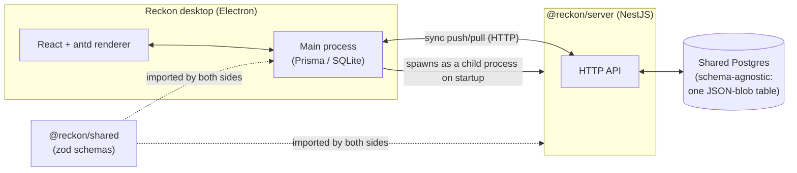
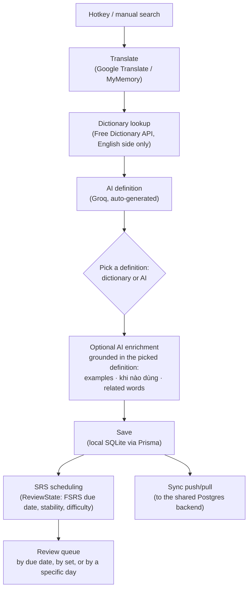

# Reckon 🧠

*Look up a word anywhere on your screen. Never lose it again.*

Reckon is a local-first desktop dictionary and vocabulary trainer. Select any
text — in a browser, a PDF, a chat window, anywhere — hit a hotkey, and a
popup appears with the translation, the definition, the IPA pronunciation,
and a real audio clip of a native speaker saying it. Save the word, drop it
into a set, and Reckon will quietly remind you to review it later using
spaced repetition — before you forget it for good.

It works fully offline for your own word list, and syncs across every
machine you install it on when you're online.

## Demo

<a href="https://youtu.be/ecgWZwLxcyA" target="_blank" rel="noopener noreferrer">
  
</a>

## Why this exists

Looking up a word usually means: alt-tab to a browser, open a new tab, type
the word, read the result, alt-tab back — and the word is gone from your
memory five minutes later. Reckon collapses that whole loop into one
keystroke, and turns every lookup into something you actually retain.

## Features

- **Global hotkey lookup** — select text anywhere in the OS, press the
  hotkey (customizable in Settings), get an answer in a popup that sizes
  itself to fit its content and never runs off the edge of your screen.
- **Real dictionary data, not just translation** — definitions, part of
  speech, example sentences, IPA, and native audio pronunciation, pulled
  live alongside the translation.
- **Two definitions, your pick** — right after a lookup, Reckon generates an
  AI definition (Groq) alongside the free-dictionary one; pick whichever
  reads better, and it grounds every other AI generation (examples, related
  words, when to use) in that specific sense of the word.
- **"Khi nào dùng" (when to use)** — an AI explanation of the situations,
  formality level, and collocations a word actually fits, not just a bare
  translation.
- **Text-to-speech** on every word, everywhere it appears.
- **Search before you commit** — look a word up, see everything about it,
  *then* decide whether it's worth saving.
- **Vocabulary sets** — organize saved words into named decks, like a
  lightweight Anki.
- **Date filters** — narrow the saved-word list to a day or range, and
  review a specific day's words on demand instead of only what's due.
- **Spaced repetition review** — a due-card queue that adapts to what you
  actually remember.
- **Cross-device sync** — your local SQLite database quietly syncs to a
  shared backend, last-write-wins, so the same word list follows you across
  installs.
- **Runs in the background** — lives in the tray, starts its own sync
  backend, gets out of your way until you need it.

## How it's built



- **Desktop app** — Electron + React + antd. Local data lives in SQLite via
  Prisma; the sync backend is spawned automatically as a child process, no
  separate service to run.
- **Sync backend** — NestJS + Prisma + Postgres. Deliberately entity-agnostic
  (`kind` + a JSON blob) so new local entity types never need a server
  migration.
- **Shared package** — zod schemas for the sync protocol, imported by both
  sides so client and server can never silently drift apart.
- **Dictionary enrichment** — the free, keyless
  [Free Dictionary API](https://dictionaryapi.dev/) for definitions/IPA/audio,
  plus Google Translate / MyMemory for the translation itself.

## How it works

A lookup starts from either a global hotkey (text selected anywhere in the
OS) or a manual search, and ends up as a spaced-repetition card:



Every step past "Translate" is best-effort and independent — a dictionary
miss, a skipped AI step, or being offline for sync never blocks saving or
reviewing a word; each just leaves that one piece of enrichment empty until
it's available.

## Project layout

```
apps/
  desktop/   Electron app — the thing you actually run
  server/    NestJS sync backend, bundled into the desktop app at package time
packages/
  shared/    zod schemas shared by both sides of the sync protocol
```

## Getting started

```bash
pnpm install
pnpm dev:desktop
```

That's it — the desktop app spawns its own sync backend on startup. You
don't need to run `dev:server` separately unless you're working on the
backend in isolation.

## Building an installer

```bash
pnpm package:desktop
```

Produces a Windows installer at `apps/desktop/release/Reckon Setup *.exe`
(and an unpacked `win-unpacked/Reckon.exe` you can run without installing).

## Releases

Pushing a version tag (`v1.2.3`) triggers a GitHub Actions workflow that
builds the installer and publishes it as a GitHub Release, so anyone can
grab the latest build from the
[Releases page](../../releases) without building it themselves.
